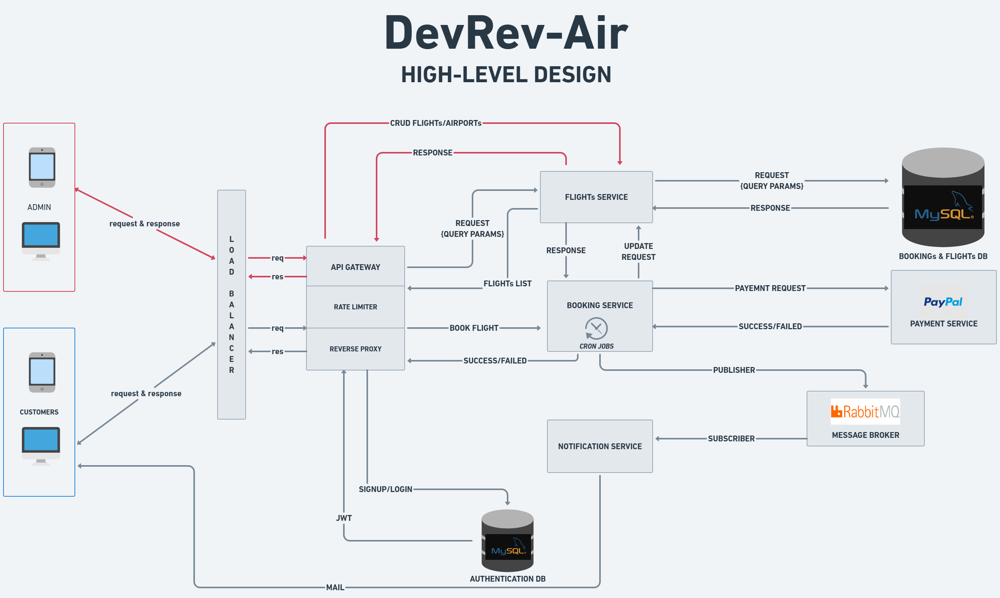

# DevRev-Air 
## Project Description
DevRev-Air is a resilient and efficient backend application specifically developed to manage and handle a wide range of Flight Management and Booking operations. It incorporates a Microservice Model-View-Controller architecture, which guarantees both scalability and availability of the system.

## Non-Functional Requirements

### 1. To prevent conflicts and inconsistencies, the application incorporates **Transaction Isolation Level**, which ensures that no two users can simultaneously book the same seat.

### 2. To avoid unintended consequences and accidental duplicate calls during the payment process, the payment gateway implements **Idempotency APIs**.

 

## High Level Design 

