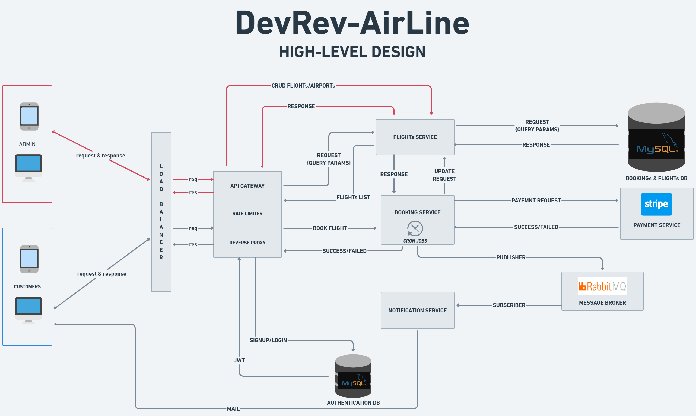

# DevRev-AirLine
## Project Description
DevRev-Air, a highly efficient and reliable **Backend Application** responsible for seamlessly managing multiple facets of flight operations, including **flight management**, **booking systems**, **real-time notifications**, and **secure payment** processing. It incorporates a **Microservice MVC architecture**, which guarantees both **scalability** and **availability** of the system.

## Non-Functional Requirements

### 1. To prevent conflicts and inconsistencies, the application incorporates **Transaction Isolation Level**, which ensures that no two users can simultaneously book the same seat.

### 2. To avoid unintended consequences and accidental duplicate calls during the payment process, the payment gateway implements **Idempotency APIs**.

 

## High Level Design 

